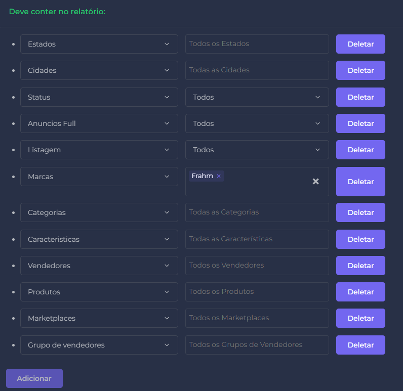

# programa  - Acompanhamento de Anuncios
# criador   - willian pinotti
# descrição - Armazenar dados de anuncios diáriamente, afim de acompanhar o periodo do anuncio no ar, anuncio restrito/fora do PSI
# senha email - Berinjela@1999# | frahm.anuncios.naoresponder@gmail.com
# Como Funciona?

# sql - grupo_vendedor atualiza
UPDATE dados_marketplace
SET grupo_nome = (
    SELECT grupo_nome
    FROM dados_marketplace dm2
    WHERE dm2.vendedor = dados_marketplace.vendedor
    ORDER BY dm2.data DESC
    LIMIT 1
)

WHERE grupo_nome != (
    SELECT grupo_nome
    FROM dados_marketplace dm2
    WHERE dm2.vendedor = dados_marketplace.vendedor
    ORDER BY dm2.data DESC
    LIMIT 1
);

- Um arquivo da zyriz é gerada todo mês com todos os anuncios de produtos frahm encontrados, incluindo restritos, não monitorados ou monitorados
  deve-se fazer dowload dele  
    - Ao criar um relatorio manual ou automatico, selecionar marca - frahm
    - NÃO SELECIONAR o campo 'anuncios irregulares', pois irá retirar anuncios restritos que não estão no PSI, o que não faz sentido para o programa.    
    

- 

# conferir tudo se ta ok, e marcar ali em cima
    - bom, preciso do zyriz funfando pra ter dados novos né
        - parece que a ferramenta da pau de vez enquando, preucupante.
        - volto a funfa, mas até quando?
        - falaro que vao resolve e tao atento, ok entao

    - Parece tudo ok por enquanto, preciso de mais dados e melhorar os brutos

    - aguardando a mudança no princing ...    

    - eu q continuo nessa bomba 

# ver os dados da consulta de grupo de vendedor

# nova planilhaa!
    - primeiro separar cliente de rep.
        - feito. 
        - arrumar os nomes dos rep e conferir nome de cliente.
            - dados desatualizados, conferir com comercial.

    - tabela atualizada

    - com isso, começar nova planilha
    - template pronto